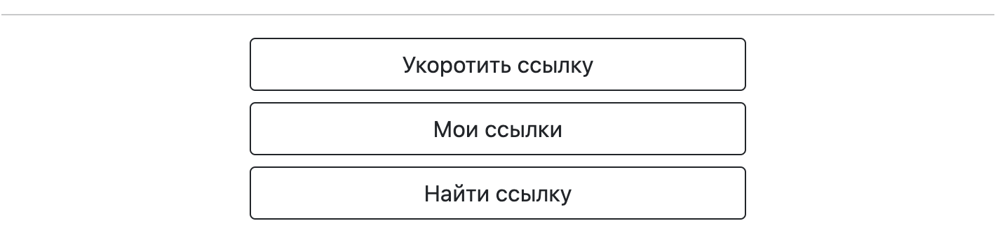
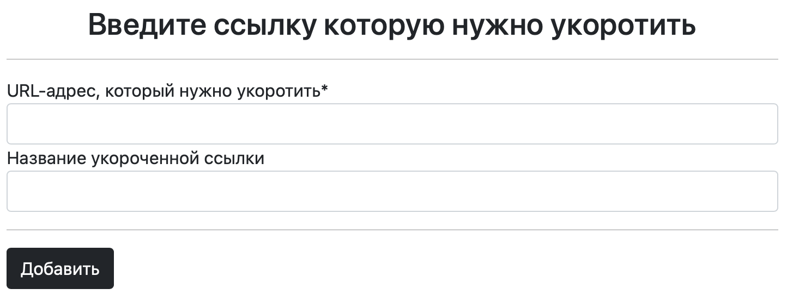

# Сервис по укорачиванию ссылок
С помощью данного сервиса вы можете: 
- сократить длину вашей ссылки
- узнать кол-во переходов по вашей новой ссылке
- узнать время создания ссылки
- просмотреть все созданные вами ссылки
- найти созданную вами ранее ссылку, указав в поиске фрагмент названия полной ссылки

## Есть 2 способа сделать ссылку короче
1) Способ первый: \
Перейдите по данному адресу: [создание коротких ссылок](http://gosha1.pythonanywhere.com/).  
У вас появится меню как указано ниже, выберите `Укоротить ссылку`:

После чего вам будет предложено ввести полный адрес ссылки которую нужно укоротить.  
Название укороченной ссылки можно придумать свое, либо оставить поле не заполненным, в этом случае сервис сам создаст название ссылки.  

Далее перейдите в меню. В разделе `Мои ссылки`, будут отображаться ваши созданные ссылки,
время их создания и кол-во переходов по новой ссылке. \
В разделе `Найти ссылку` вы можете найти необходимую вам ссылку среди всех ваших ссылок, для этого достаточно указать только фрагмент от полной ссылки.

2) Способ второй: \
Перейдите по данному адресу: [создание коротких ссылок с помощью graphql](https://gosha1.pythonanywhere.com/graphql/).    


Для того чтобы создать короткое представление URL, скопируйте данное выражение, укажите необходимый (полный) url-адрес и запустите:
```javascript
mutation {
  createLink(receivedUrl:"Введите полное название ссылки") {
    url {
    id
    receivedUrl
    shortUrl
    amountClicks
    createdAt
    }
  }
}
```

Чтобы показать все ваши ссылки:
```javascript
query {
  links {
    id
    receivedUrl
    shortUrl
    amountClicks
    createdAt
  }
}
```
Поиск ссылки по фрагменту названия полной ссылки:
```javascript
query {
  links(url:"Введите фрагмент url который нужно найти") {
    id
    receivedUrl
    shortUrl
    amountClicks
    createdAt
  }
}
```
В данных выражениях:
- `id` - id url-адреса
- `receivedUrl` - полный url-адрес, который нужно укоротить
- `shortUrl` - полученное короткое представление заданного URL
- `amountClicks` - количество переходов по новой ссылке
- `createdAt` - время и дата создания новой ссылки 

Чтобы перейти по новой ссылке добавьте полученный `shortUrl`:
```
http://gosha1.pythonanywhere.com/ваш полученный shortUrl
```

### Как установить на свой компьютер

Для запуска на своем компьютере вам потребуется:

1. Свежая версия [Python](https://www.python.org).
2. Сохранить библиотеку на свой компьютер:
```
https://github.com/inkvizitor1991/shorten_link.git
``` 
3. Установить зависимости:
```
pip install -r requirements.txt
``` 
4. Создайте базу данных SQLite:

```sh
python3 manage.py migrate
```
5. Запустить скрипт:
```
python manage.py runserver
``` 
6. Перейти по ссылке:
`http://127.0.0.1:5500`

### Переменные окружения

Часть настроек проекта берётся из переменных окружения. Чтобы их определить, создайте файл `.env` рядом с `manage.py` и запишите туда данные в таком формате: `ПЕРЕМЕННАЯ=значение`.

Доступны 3 переменные:
- `DEBUG` — дебаг-режим. Поставьте `True`, чтобы увидеть отладочную информацию в случае ошибки.
- `SECRET_KEY` — секретный ключ проекта
- `ALLOWED_HOSTS` — см [документацию Django](https://docs.djangoproject.com/en/3.1/ref/settings/#allowed-hosts)  
